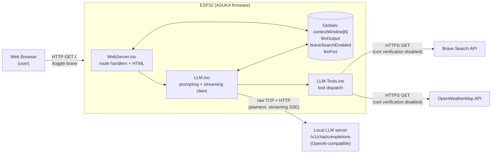
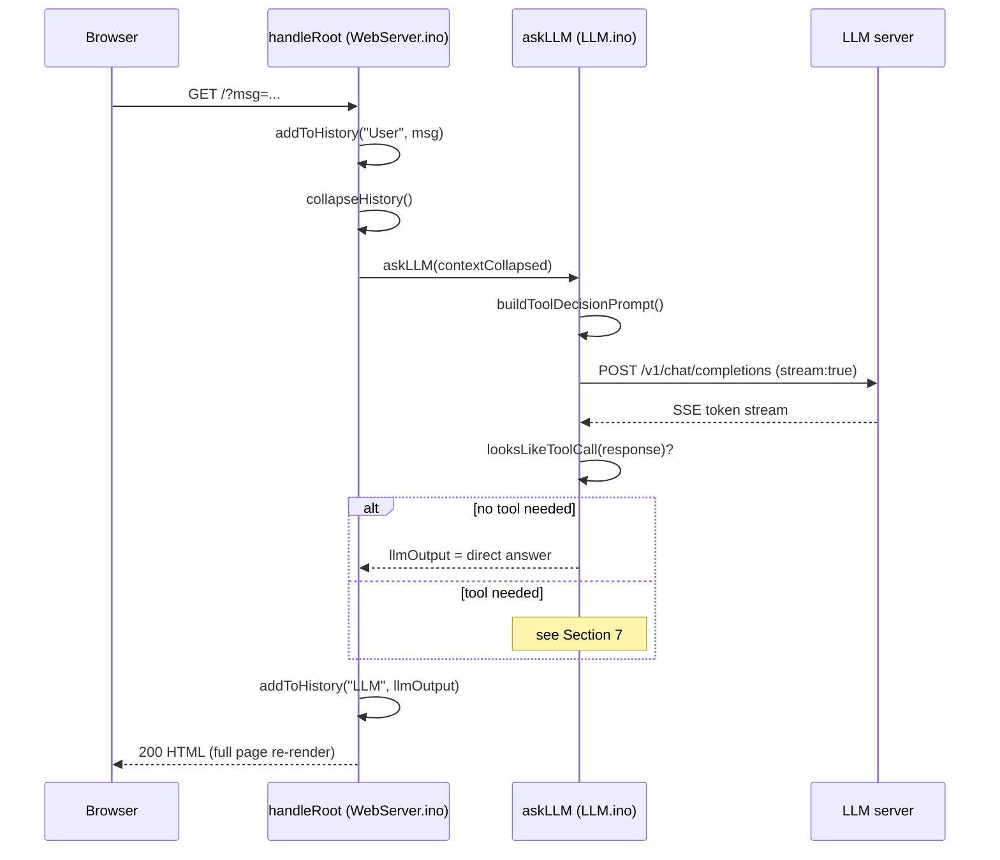

# ASUKA — Architecture Report

_Last reviewed: 2026-07-10, against the working tree on `main`._

## 1. What ASUKA Is

ASUKA is a firmware sketch for an ESP32 microcontroller that turns the chip into a small,
self-hosted web front end for a locally-hosted LLM (large language model) server. A user
connects a browser to the ESP32's IP address, types a message into a web form, and the
ESP32 relays that message to an OpenAI-API-compatible chat completion endpoint running
elsewhere on the network (e.g. llama.cpp server, text-generation-webui, LM Studio, etc.).
The model's streamed reply is displayed back on the same page.

On top of plain chat, ASUKA implements a lightweight two-pass **tool-calling** system: the
model can ask the firmware to perform a live web search (via the Brave Search API) or fetch
current weather (via OpenWeatherMap) before producing its final answer.

The whole application — web server, HTML rendering, LLM client, and tool integrations —
runs in a single Arduino `setup()`/`loop()` process with no RTOS tasks, no persistent
storage of conversation state, and no authentication.

## 2. Tech Stack

| Layer | Technology |
|---|---|
| Hardware target | ESP32 (implied by `WiFi.h`, `WiFiClientSecure.h`, OTA-style partition table) |
| Framework | Arduino core for ESP32 |
| HTTP server | `WebServer` library (synchronous, single-request-at-a-time) |
| HTTP/HTTPS client | `HTTPClient` + `WiFiClientSecure` (for Brave/OpenWeatherMap) and raw `WiFiClient` (for the local LLM) |
| JSON | `ArduinoJson` |
| Build unit | Classic multi-`.ino` Arduino sketch — `ASUKA.ino`, `WebServer.ino`, `LLM.ino`, `LLM-Tools.ino` are concatenated by the Arduino build system into one translation unit, in that alphabetical/tab order, sharing globals implicitly |

## 3. Source Layout

```
ASUKA.ino        Entry point: globals, setup(), loop(), route registration
WebServer.ino    HTML page generation + HTTP route handlers
LLM.ino          Prompt construction, streaming HTTP client to the LLM server, chat history
LLM-Tools.ino    Tool implementations (Brave Search, OpenWeatherMap) + tool dispatch + URL encoding
config.h         Local secrets/config (gitignored; not committed)
config.h.example Template for config.h
partitions.csv   Custom ESP32 flash partition table (OTA-style dual app partitions + SPIFFS)
```

Because Arduino compiles all `.ino` files in a sketch as one unit, there are no header
files or forward declarations between them — functions and globals declared in one file
are visible in all the others. This is idiomatic for small Arduino sketches but means the
four files are **not independently reusable modules**; they only compile together.

## 4. System Diagram



## 5. Runtime State (globals)

All conversation and configuration state lives in RAM as global variables declared in
`ASUKA.ino:8-14`. There is no SD card, no NVS/Preferences use, and no SPIFFS use in the
current code, despite the partition table reserving a SPIFFS region — state does not
survive a reboot.

| Variable | Type | Purpose |
|---|---|---|
| `braveSearchEnabled` | `bool` | Feature flag toggled via `/toggle-brave`; gates the `brave_search` tool |
| `server` | `WebServer` | The HTTP server instance, listening on port 80 |
| `inputLine` | `String` | Last raw message submitted by the user |
| `llmOutput` | `String` | Most recent LLM answer, shown on the page |
| `contextWindow[6]` | `String[6]` | Ring buffer of the last 6 chat turns (`"User: ..."` / `"LLM: ..."`) |
| `contextCollapsed` | `String` | `contextWindow` flattened into one quoted block, sent to the LLM as the prompt |
| `llmPort` (in `config.h`) | `uint16_t` | Port of the LLM server; user-editable at runtime via the web form |

Because `contextWindow` is a fixed 6-slot array shifted manually (see `addToHistory` in
`LLM.ino`), history is capped at 3 user/assistant exchanges — the oldest turn is silently
dropped once the buffer is full.

## 6. Request Lifecycle — Plain Chat



Every request re-renders the **entire page** server-side (`buildMainPageHtml`); there is
no client-side JS, no partial updates, and no WebSocket — each message is a full page
reload via a GET form submission.

## 7. Tool-Calling System

ASUKA implements a **two-pass** tool-calling flow, plus a **fast-path shortcut** for
weather:

```mermaid
flowchart TD
    Start(["askLLM(message)"]) --> WeatherCheck{"Weather API key set\nAND message mentions\nweather/forecast/rain/etc?"}
    WeatherCheck -- yes --> DirectWeather["Synthesize openweather_current\ntool call directly\n(skips model's own tool choice)"]
    DirectWeather --> RunTool1["handleToolCall()"]
    RunTool1 --> Followup1["streamLLMResponse(\nbuildToolFollowupPrompt)"]
    Followup1 --> Done1(["llmOutput"])

    WeatherCheck -- no --> Pass1["Pass 1:\nstreamLLMResponse(\nbuildToolDecisionPrompt)"]
    Pass1 --> IsToolCall{"looksLikeToolCall()?\n(starts with '{' and\ncontains \"tool\")"}
    IsToolCall -- no --> Done2(["llmOutput = model's\ndirect answer"])
    IsToolCall -- yes --> RunTool2["handleToolCall()"]
    RunTool2 --> Followup2["Pass 2:\nstreamLLMResponse(\nbuildToolFollowupPrompt)"]
    Followup2 --> Done3(["llmOutput"])
```

**Available tools** (dispatched in `handleToolCall`, `LLM-Tools.ino:313`):

| Tool name | Backing function | External API | Gate condition |
|---|---|---|---|
| `brave_search` | `braveSearch()` | Brave Search API (HTTPS) | `braveSearchEnabled == true` |
| `openweather_current` | `openWeatherCurrent()` | OpenWeatherMap current-weather API (HTTPS) | `OPENWEATHER_API_KEY` non-empty |

The model is told which tools are available (and their exact JSON call schema) inside
`buildToolDecisionPrompt()`. This is a **prompt convention**, not a structured/function-
calling API — the model must reply with a raw JSON object as its entire message, and
`looksLikeToolCall()` uses a heuristic (`startsWith("{")` + contains `"tool"`) to detect
it. A model that wraps JSON in markdown fences or adds explanatory text before it will
fail this check and be treated as a direct answer instead.

The weather fast-path (`messageNeedsCurrentWeather`) bypasses the model's own tool
judgement entirely for a fixed keyword list (`weather`, `forecast`, `temperature`, `rain`,
`snow`, `wind`) — this trades a small amount of over-triggering (e.g. "how's the vibe,
stormy relationship") for saving a full model round trip on the common case.

## 8. LLM Client Protocol (`LLM.ino`)

`streamLLMResponse()` does **not** use `HTTPClient`; it opens a raw `WiFiClient` TCP
socket and hand-writes an HTTP/1.1 POST request (`LLM.ino:73-109`), then manually parses
the response as **Server-Sent Events** (`data: {...}\n\n`, terminated by `data: [DONE]`),
extracting `choices[0].delta.content` from each JSON chunk via `extractContent()`. This
mirrors the OpenAI streaming chat completion format.

Key characteristics:
- **Plaintext, unauthenticated** — no TLS, no API key sent to the LLM server. Acceptable
  only if the LLM server is trusted and network-isolated.
- **30-second connect/read timeouts** on both the initial connection and the byte-wait
  loop, to avoid an indefinitely blocked `loop()`.
- **Request buffer**: `StaticJsonDocument<3072>` — the outgoing request (system prompt +
  full collapsed history + user message) must fit in ~3KB of serialized JSON or
  `ArduinoJson` will silently drop fields.
- Tokens are echoed live to `Serial` as they stream in, useful for debugging over USB.

## 9. Web Routes

| Route | Method | Handler | Behavior |
|---|---|---|---|
| `/` | GET | `handleRoot` | Renders the full page. If `msg` param present: submits a chat turn. If `port` param present: validates and updates `llmPort`. Otherwise just re-renders current state. |
| `/toggle-brave` | GET | `handleToggleBrave` | Flips `braveSearchEnabled`, 303-redirects to `/` |
| `/get-text` | GET | `handleText` | Legacy/dead route — immediately 303-redirects to `/` and does nothing else |

All forms use `GET`, so chat messages and port numbers appear in the URL, browser
history, and (if any) proxy/server logs.

## 10. Configuration & Build

- `config.h` (gitignored) holds WiFi credentials, LLM host/port/path, Brave and
  OpenWeatherMap API keys, fixed weather coordinates, and the system prompt. It is
  compiled directly into the firmware image as plaintext `const char*` — anyone with
  flash read access to the device recovers all secrets.
- `config.h.example` is the checked-in template new contributors copy from.
- `partitions.csv` defines a **dual-OTA** partition layout (`app0`/`app1` at 0x140000
  each, plus `nvs`, `otadata`, and a `spiffs` region). No OTA update code exists in the
  sketch today — the partition table is provisioned for it but unused, and the `spiffs`
  partition is likewise unused by the current code.

## 11. Known Limitations & Risks

1. **No authentication on the web server** — anyone on the network (or anyone who can
   reach port 80) can chat through the device, flip the Brave Search toggle, or change
   the LLM port.
2. **`setInsecure()` on all outbound HTTPS clients** (`braveSearch`, `openWeatherCurrent`)
   — TLS certificate validation is explicitly disabled for both Brave and OpenWeatherMap
   calls, making those requests vulnerable to on-path tampering/eavesdropping despite
   using HTTPS. Both call sites flag this as a "development shortcut" in comments.
3. **Plaintext LLM transport** — no encryption or auth between the ESP32 and the LLM
   backend.
4. **Blocking, single-threaded execution** — `loop()` only calls
   `server.handleClient()`; a slow LLM/Brave/OpenWeatherMap response blocks the entire
   device (no other client can be served, no other work happens) for up to 30 seconds
   per network hop, and a full turn can chain up to two LLM streams plus one tool call.
5. **Secrets compiled into firmware** — no separation between config and secrets; anyone
   who can dump flash gets WiFi credentials and API keys in plaintext.
6. **Heuristic tool-call detection** — `looksLikeToolCall()` is a simple string check, not
   a schema-validated response format; malformed or stylistically different model output
   silently falls through to being treated as a direct answer (or, for genuine tool JSON
   with a bad shape, to `handleToolCall`'s own defaults/errors).
7. **Fixed-size JSON buffers** — `StaticJsonDocument<3072>` (LLM request) and
   `StaticJsonDocument<512>` (SSE chunk parse) cap payload sizes; long conversation
   histories or unusually large streamed chunks could silently fail to serialize/parse.
8. **Chat state does not persist** — a reboot or crash clears `contextWindow` and
   `llmOutput` with no recovery.
9. **GET-based forms** — chat content becomes part of the URL, exposing it in browser
   history and any logging middleware between the client and device.
10. **Output is escaped, but note the escape function's scope** — `renderTextForHtml()`
    escapes `&`, `<`, `>` and converts newlines to `<br>` before both chat history and
    `llmOutput` are placed into the page, so reflected/stored HTML injection from user
    messages or model output is mitigated in the current handlers, provided any future
    code path also routes text through it before embedding it in HTML.

## 12. Suggested Areas for Future Work

- Add authentication (even HTTP basic auth) before exposing the device beyond a trusted
  LAN.
- Replace `setInsecure()` with real certificate validation (`setCACert`) for Brave and
  OpenWeatherMap.
- Move the LLM connection to TLS if the backend ever leaves a trusted local network.
- Persist chat history and settings (`llmPort`, `braveSearchEnabled`) to NVS/SPIFFS so
  they survive reboot, since the partition table already reserves space for it.
- Consider `AsyncWebServer` or a task-based approach if concurrent clients or
  non-blocking behavior become requirements.
