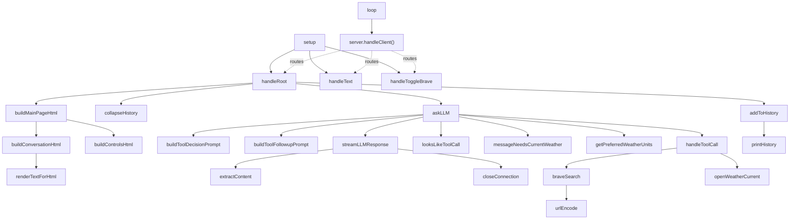

# ASUKA — Engineering Report (Function-by-Function Guide)

_Written for engineers who are newer to C++, embedded systems, or this codebase. Pairs
with [ARCHITECTURE.md](ARCHITECTURE.md), which covers the big picture — this document
walks through every function in plain language._

## How to read this document

Each function entry has:
- **What it does** — one or two sentences, no jargon.
- **Inputs / Outputs** — what goes in, what comes back.
- **Walkthrough** — step by step, in order.
- **Things to watch out for** — traps, edge cases, or non-obvious behavior.

A few concepts that come up constantly, explained once here so we don't repeat them:

- **`String`** is Arduino's built-in text type (like a lightweight, mutable version of a
  string in other languages). `str.trim()`, `str.indexOf()`, `str += "x"` etc. all mutate
  or query it.
- **`JsonDocument` / `StaticJsonDocument<N>`** (from the ArduinoJson library) is an
  in-memory JSON object/array, similar to a Python dict or JS object, but with a fixed
  memory budget (`N` bytes) because the ESP32 has limited RAM.
- **"Tool call"** means the LLM (the AI model) decided it needs live data (like a web
  search or weather) instead of answering from its own training. It signals this by
  replying with a JSON object like `{"tool":"brave_search","arguments":{...}}` instead of
  a normal sentence.
- **SSE ("Server-Sent Events")** is a simple streaming format where a server sends lines
  like `data: {...}` one at a time as it generates them, instead of one big response at
  the end. This is how the LLM's answer arrives token-by-token.

---

## File: `ASUKA.ino` — the entry point

This is where the program starts. Arduino sketches always have a `setup()` (runs once)
and a `loop()` (runs forever, over and over).

### `setup()`
**What it does:** Turns the board on, connects to WiFi, and starts the web server.

**Walkthrough:**
1. Opens the serial (USB) connection at 115200 baud so we can print debug messages to a
   computer.
2. Starts WiFi using the `ssid`/`password` from `config.h`.
3. Loops, printing a `.` every half second, until WiFi reports "connected." **This is a
   blocking loop** — if WiFi credentials are wrong, the board will sit here forever,
   printing dots, and never reach the rest of `setup()`.
4. Prints the device's IP address to serial — this is the address you type into a
   browser to reach the web page.
5. Registers three URL routes with the web server: `/`, `/get-text`, `/toggle-brave`
   (see `WebServer.ino` for what each does).
6. Starts the web server listening on port 80 (the standard HTTP port).

**Watch out for:** There's no timeout on the WiFi connection loop — a wrong password
means the device never boots into a usable state, with no error shown except dots on
serial.

### `loop()`
**What it does:** The heartbeat of the program. Runs forever.

**Walkthrough:** Calls `server.handleClient()`, which checks if a browser has sent a
request and, if so, processes it (which may call all the way down into the LLM and
external APIs before returning).

**Watch out for:** Because this is the *only* thing in `loop()`, and `handleClient()`
does not return until a full request (including LLM calls) finishes, the device cannot
do anything else — no background tasks, no second client — while a chat request is being
processed. A slow LLM response makes the whole device "freeze" from the outside for as
long as that response takes.

---

## File: `WebServer.ino` — the web page and its routes

This file builds the HTML page (as one big string, no template engine or client-side
JavaScript) and defines what happens when a browser visits each route.

### `buildControlsHtml()`
**What it does:** Builds the HTML for the bottom control panel — the message box, the
"LLM Port" field, and the "Enable/Disable Brave Search" button.

**Inputs/Outputs:** No parameters. Returns a `String` of HTML.

**Walkthrough:** It's mostly a fixed HTML template, except the Brave Search button's
label and status text change depending on the current value of the global
`braveSearchEnabled` (`"Enabled"`/`"Disabled"`, and the button offers the opposite
action).

**Watch out for:** All the form fields submit via `GET` (`method="GET"`), which means
whatever you type appears in the browser's address bar and history.

### `buildConversationHtml()`
**What it does:** Builds the HTML for the top panel — the scrolling chat history plus the
latest model reply.

**Walkthrough:**
1. Starts the panel and a heading.
2. Loops through the 6-slot `contextWindow` array. For each non-empty slot, prints it as
   one line of transcript. If every slot is empty, shows "No conversation yet." instead.
3. Below that, shows the most recent answer (`llmOutput`) in its own "Latest Response"
   box, or "No response yet." if empty.
4. All text going into the page is passed through `renderTextForHtml()` first (see
   below) so it can't break the page's HTML structure.

### `buildMainPageHtml()`
**What it does:** Assembles the entire HTML page that gets sent to the browser: page
`<head>` with embedded CSS, then the conversation panel, then the controls panel.

**Walkthrough:** It's one big `String` containing the CSS styling (colors, layout,
responsive rules for narrow screens), then calls `buildConversationHtml()` and
`buildControlsHtml()` to fill in the two main sections, and closes the HTML tags.

**Watch out for:** There is no separate CSS file — styling lives entirely inline in this
C++ string. If you want to change how the page looks, you're editing quoted strings in
this function, not a `.css` file.

### `renderTextForHtml(text)`
**What it does:** Takes raw text (a chat message or an LLM answer) and makes it safe to
put inside an HTML page, converting line breaks and escaping characters that would
otherwise be interpreted as HTML tags.

**Inputs/Outputs:** Takes a `String`. Returns a new, HTML-safe `String`.

**Walkthrough:** Goes character by character:
- `\r\n` or `\n` (line breaks) become `<br>`.
- `&` becomes `&amp;` (must happen before the other replacements, otherwise it would
  double-escape the entities it's about to create).
- `<` becomes `&lt;`.
- `>` becomes `&gt;`.
- Everything else is copied through unchanged.

**Why this matters:** Without this function, if a user typed `<script>alert(1)</script>`
into the chat box, that raw text would be inserted directly into the page's HTML and the
browser could execute it (a "cross-site scripting" or XSS bug). Escaping it first turns
it into inert visible text instead. **Any new place that inserts user or model text into
the page HTML should also go through this function.**

### `handleRoot()`
**What it does:** The main request handler for `/`. Handles three situations depending on
what the browser sent: updating the LLM port, submitting a chat message, or just loading
the page fresh.

**Walkthrough:**
1. **If a `port` value was submitted:** reads it as text, trims whitespace, and checks
   every character is a digit (rejecting anything like `"90a0"` or a blank value). If it
   passes that check, converts it to a number and makes sure it's between 1 and 65535
   (the valid range for a network port). If either check fails, shows an error message on
   the page and leaves the old port unchanged. If it passes, updates the global `llmPort`.
2. **Else if a `msg` value was submitted:** this is the normal chat path.
   - Saves the message into `inputLine`.
   - Adds it to the rolling history (`addToHistory`, in `LLM.ino`).
   - Prints it to serial for debugging.
   - Calls `collapseHistory()` to turn the history array into one prompt-ready block of
     text.
   - Calls `askLLM()` with that block — this is where the actual AI request happens, and
     may take several seconds.
   - Saves the LLM's answer into history too.
   - Clears the temporary "collapsed" string.
3. **Either way, at the end:** sends back the freshly rendered full page.

**Watch out for:** This function does double duty — port updates and chat messages both
route through `/`, distinguished only by which query parameter is present. If a request
somehow included both `port` and `msg`, only the `port` branch would run (it's checked
first with `else if`).

### `handleToggleBrave()`
**What it does:** Flips the Brave Search on/off switch and sends the browser back to the
main page.

**Walkthrough:** Inverts `braveSearchEnabled` (`true` becomes `false` and vice versa),
then responds with an HTTP 303 redirect back to `/`. The 303 status specifically tells
the browser "go fetch this with a GET," which avoids the classic problem of a page reload
re-submitting the same toggle action.

### `handleText()`
**What it does:** Nothing functional — it's a leftover/compatibility route. Any request
to `/get-text` is immediately redirected to `/` without reading or using anything from
it.

**Watch out for:** This route is registered in `setup()` but doesn't do real work. If
you're looking for where chat messages get handled, that's `handleRoot()`, not this
function — this one is effectively dead code kept for backward compatibility with old
links/bookmarks.

---

## File: `LLM.ino` — talking to the AI model

This file is the "brain" of the request flow: it decides what prompt to send, streams the
model's answer back over a raw network socket, and manages the rolling chat history.

### `buildToolDecisionPrompt(message)`
**What it does:** Builds the first prompt sent to the LLM — one that tells the model
what tools (if any) it's allowed to use, and asks it to either answer directly or request
a tool.

**Inputs/Outputs:** Takes the user's message. Returns the full prompt `String`.

**Walkthrough:**
1. Starts with a base instruction identifying the assistant as running on an ESP32.
2. Checks whether a weather API key is configured (a tool "is available" only if its key
   is non-empty).
3. If Brave Search and/or weather are available, tells the model the *exact* JSON shape
   to reply with for each ("respond with only a single JSON object and no markdown").
4. If neither tool is available, tells the model plainly not to attempt any tool calls
   and to answer from built-in knowledge only.
5. Appends "User request: " plus the actual message.

**Watch out for:** This is a plain-text instruction to the model, not an enforced API
contract — the model could ignore it, add extra commentary, or format the JSON slightly
differently, all of which downstream code (`looksLikeToolCall`) has to guess about.

### `buildToolFollowupPrompt(originalMessage, toolResult)`
**What it does:** Builds the *second* prompt, used after a tool has already run, so the
model can turn raw tool data (like search results or weather numbers) into a normal
human-readable answer.

**Inputs/Outputs:** Takes the original user message and the tool's JSON result. Returns
the combined prompt `String`.

**Walkthrough:** Concatenates a fixed instruction ("answer using the tool result below,
don't call more tools, mention useful URLs") with the original request and the tool's
JSON output.

### `looksLikeToolCall(response)`
**What it does:** A quick, rough test for "did the model just ask us to run a tool, or did
it just answer normally?"

**Inputs/Outputs:** Takes the model's raw response text. Returns `true`/`false`.

**Walkthrough:** Trims whitespace, then checks two things: does the text start with `{`,
and does it contain the substring `"tool"` anywhere. If both are true, it's treated as a
tool call.

**Watch out for:** This is a heuristic, not real JSON validation. A normal answer that
happens to start with `{` and mentions the word "tool" (e.g. explaining what a tool is)
would be misidentified as a tool call. Conversely a tool call wrapped in markdown code
fences (```` ```json ````) would fail the `startsWith("{")` check and be treated as a
plain answer instead.

### `messageNeedsCurrentWeather(message)`
**What it does:** Cheaply guesses whether the user is asking about weather, without
involving the LLM at all.

**Walkthrough:** Lowercases the message and checks for the substrings `weather`,
`forecast`, `temperature`, `rain`, `snow`, or `wind`. Any match returns `true`.

**Watch out for:** This is a blunt keyword match — "how's the weather in your code"
(a metaphor) would trigger it just as much as "what's the weather like."

### `getPreferredWeatherUnits(message)`
**What it does:** Guesses whether the user wants Fahrenheit/mph ("imperial") or
Celsius/m/s ("metric") units, based on words in their message.

**Walkthrough:** Lowercases the message; if it contains `imperial`, `fahrenheit`, or
` mph` (note the leading space, so it doesn't match inside another word), returns
`"imperial"`. Otherwise defaults to `"metric"`.

### `streamLLMResponse(message, responseOut)`
**What it does:** The core network function — opens a raw connection to the LLM server,
sends a chat request, and reads back the model's answer as it streams in, piece by piece.

**Inputs/Outputs:** Takes the full prompt text and a `String&` (a reference — meaning this
function writes its result directly into a variable the caller owns) to fill with the
final answer. Returns `true` on success, `false` on any failure (connection, timeout,
etc).

**Walkthrough (this is the most complex function in the codebase — read slowly):**
1. Clears `responseOut`.
2. Opens a plain TCP connection to `llmHost:llmPort`. If it can't connect, prints an
   error and returns `false` immediately.
3. Sets a 30-second timeout so a stuck read doesn't hang forever.
4. Builds a JSON request body by hand using `StaticJsonDocument<3072>` — a fixed 3KB
   memory budget. Sets `model`, `stream: true` (ask for streaming), `temperature: 0.7`
   (moderate creativity), `max_tokens: 4096`, and a `messages` array containing (if
   configured) a system message plus the user's message.
5. Serializes that JSON into a `String` called `body`.
6. **Writes a raw HTTP request by hand** — this is unusual; most code would use a library
   like `HTTPClient` for this, but here the headers (`POST ... HTTP/1.1`, `Host`,
   `Content-type`, `Accept: text/event-stream`, `Connection: close`, `Content-Length`)
   and the body are written directly to the socket as text.
7. Waits (up to 30 seconds) for the server to start responding at all.
8. Reads and discards the HTTP response headers line by line until it hits the blank line
   that separates headers from body.
9. Enters the main streaming loop: reads one line at a time. Lines that don't start with
   `data:` (SSE keepalives, blank lines) are skipped. `data: [DONE]` means the stream is
   finished. Any other `data: {...}` line is handed to `extractContent()` to pull out just
   the new text fragment, which is printed to serial (for live debugging) and appended to
   `responseOut`.
10. Once done, prints a newline and calls `closeConnection()` to clean up the socket.
11. Returns `true`.

**Watch out for:**
- If the connection drops mid-stream without sending `[DONE]`, the loop still exits
  cleanly (because the `while` condition also checks `client.connected()`), but the
  answer may be truncated with no explicit error surfaced to the caller.
- The 3KB request buffer means a very long chat history plus a long user message could
  overflow the JSON document; ArduinoJson handles this by silently failing to add data
  rather than crashing, which could produce a malformed/incomplete request without an
  obvious error.

### `askLLM(message)`
**What it does:** The main "ask a question and get an answer, using tools if necessary"
function — this is what `handleRoot()` calls per user message. Sets the global
`llmOutput`.

**Walkthrough:**
1. Clears `llmOutput`.
2. **Weather fast path:** if the weather tool is configured *and*
   `messageNeedsCurrentWeather(message)` is true, it skips asking the model whether it
   wants a tool and directly constructs an `openweather_current` tool call, runs it via
   `handleToolCall()`, and if that succeeds, asks the model a follow-up question
   (`buildToolFollowupPrompt`) to turn the raw weather JSON into a normal sentence. Any
   failure along this path sets an error message into `llmOutput` and returns early.
3. **Normal path** (weather fast path didn't apply): sends `buildToolDecisionPrompt()` to
   the model as the first LLM call. If that call itself fails (network/timeout), sets an
   error message and stops.
4. If the response doesn't look like a tool call (`looksLikeToolCall` is false), that
   response *is* the final answer — done.
5. If it does look like a tool call, runs it via `handleToolCall()`. If the tool call
   fails, surfaces the tool's error message (or a generic one) and stops.
6. If the tool succeeded, makes a second LLM call with `buildToolFollowupPrompt()` to
   turn the tool's raw data into a final human-readable answer.

**Watch out for:** In the worst case, a single user message can trigger *two* full LLM
round trips (decision + follow-up) plus one external API call, each with its own timeout
— a slow chain here is the main reason the whole device can feel "frozen" for several
seconds after sending a message.

### `closeConnection(client)`
**What it does:** Cleanly shuts down a network connection, making sure no leftover bytes
are sitting in the buffer.

**Walkthrough:** For up to 2 seconds, while the connection is still open or has unread
data, reads and throws away any remaining bytes. Then calls `client.stop()` to release the
connection.

**Why this matters:** Not draining a socket before closing it can, on some platforms/
libraries, cause connection resets or resource leaks over many requests. This is
defensive cleanup.

### `extractContent(json, outContent)`
**What it does:** Given one chunk of the model's streamed output (one SSE `data:` line's
JSON), pulls out just the new text fragment.

**Inputs/Outputs:** Takes the JSON text and a `String&` to write the extracted text into.
Returns `true` if a text fragment was found, `false` otherwise (which the caller
interprets as "nothing to add, skip this chunk").

**Walkthrough:** Parses the JSON (into a small 512-byte buffer, since each chunk is
small). Looks for `choices[0].delta.content` — the OpenAI streaming format's standard
location for a new token. If the JSON is malformed, or `choices` is missing/empty, or
`delta` has no `content` field (this happens on the first "role" event or the final
"finish" event in the stream), it returns `false` without touching `outContent`.

### `addToHistory(sender, message)`
**What it does:** Adds one new line to the rolling 6-slot conversation history, dropping
the oldest one if full.

**Inputs/Outputs:** Takes who sent it (`"User"` or `"LLM"`) and the message text. No
return value — it modifies the global `contextWindow` array directly.

**Walkthrough:** This is a manual **ring buffer** shift: it copies slot 1 into slot 0,
slot 2 into slot 1, ... slot 5 into slot 4 (each slot overwrites the one before it),
which frees up slot 5. Then it writes the new `"sender: message"` line into slot 5 (the
newest, "most recent" position). Finally calls `printHistory()` to log the result.

**Watch out for:** With only 6 slots and each user turn + LLM turn taking 2 slots, this
holds roughly 3 back-and-forth exchanges before the oldest one falls off — there's no
warning to the user when this happens, it just silently forgets.

### `printHistory()`
**What it does:** Debug helper — prints the current chat history to the serial console.

**Walkthrough:** Loops through all 6 slots, printing any that aren't empty.

### `collapseHistory()`
**What it does:** Converts the 6-slot history array into one single block of text,
formatted for inclusion in a prompt, and stores it in the global `contextCollapsed`.

**Walkthrough:** For each non-empty slot, appends a line like `> User: hello\n` (a
`>`-quoted line) to `contextCollapsed`. Also prints the result to serial for debugging.

---

## File: `LLM-Tools.ino` — the tools the AI can use

This file implements the actual work behind each tool the model can request, plus the
dispatcher that figures out which tool was requested.

### `braveSearch(query, resultCount, toolResult)`
**What it does:** Performs a live web search using the Brave Search API and returns a
compact JSON summary of the results.

**Inputs/Outputs:** Takes the search text, how many results to fetch, and a `String&` to
write the JSON result (or error) into. Returns `true` on success, `false` on any failure.

**Walkthrough:**
1. Rejects an empty query immediately, writing a JSON error.
2. Trims the query to Brave's documented 400-character limit.
3. Builds the request URL, including the query (percent-encoded via `urlEncode()`), the
   result count, and fixed settings (US country, English, moderate safe search).
4. Opens an HTTPS connection using `WiFiClientSecure` with `setInsecure()` — meaning it
   encrypts the traffic but does **not** verify the server's certificate is genuine (see
   Architecture doc, Section 11, for why this matters).
5. Sends a GET request with the Brave API key in the `X-Subscription-Token` header.
6. If the request fails outright (no response) or returns a non-200 status, logs details
   to serial and returns a JSON error (including the upstream error body when available).
7. On success, uses an ArduinoJson **filter** to parse *only* `web.results[].title`,
   `.url`, and `.description` out of Brave's (much larger) response — this keeps memory
   usage down by never even parsing the fields we don't need.
8. Builds a compact output JSON: the (trimmed) query plus an array of
   `{title, url, description}` objects.
9. Logs the final JSON to serial, then writes it into `toolResult` and returns `true`.

**Watch out for:** `setInsecure()` means this "encrypted" connection can still be
intercepted/tampered with by anyone able to sit on the network path (e.g. a rogue WiFi
access point) without the device noticing anything wrong.

### `openWeatherCurrent(requestedUnits, toolResult)`
**What it does:** Fetches current weather conditions for a fixed, pre-configured location
(set in `config.h` — this tool cannot look up arbitrary locations) from OpenWeatherMap.

**Inputs/Outputs:** Takes the desired unit system (`"metric"` or `"imperial"`) and a
`String&` for the result. Returns `true`/`false`.

**Walkthrough:**
1. If no API key is configured, immediately returns a JSON error.
2. Normalizes and validates the `requestedUnits` value — defaults to `"metric"` if blank,
   rejects anything that isn't exactly `"metric"` or `"imperial"`.
3. Builds the request URL using the fixed latitude/longitude from `config.h`, the API
   key, and the units.
4. Same `setInsecure()` HTTPS pattern as `braveSearch()`.
5. Sends the GET request, handles connection failures and non-200 responses the same way
   as `braveSearch()` (log + JSON error with upstream details when available).
6. On success, parses the full weather JSON (no filter this time — the response is small
   enough not to need one) and builds a compact, normalized output: location label/coords,
   condition summary, description, temperature (current + "feels like", with the correct
   unit label `F`/`C`), humidity, and wind speed (with the correct unit label `mph`/`m/s`).
7. Logs and returns the result, same pattern as `braveSearch()`.

**Watch out for:** This tool always reports weather for one hardcoded location — it
cannot answer "what's the weather in Tokyo" even though the model might request it that
way; it will just return data for whatever location is configured in `config.h`.

### `handleToolCall(jsonInput, toolResult)`
**What it does:** The dispatcher — takes the raw JSON text the LLM produced (its
"tool call"), figures out which tool it's asking for, validates the arguments, and calls
the right function.

**Inputs/Outputs:** Takes the model's JSON text and a `String&` for the result. Returns
`true`/`false`.

**Walkthrough:**
1. Parses `jsonInput` as JSON. If it's not valid JSON at all, returns a JSON error.
2. Reads the `"tool"` field. If missing/empty, returns a JSON error.
3. **If `tool == "brave_search"`:**
   - Checks the `braveSearchEnabled` flag; if off, returns an error without doing
     anything.
   - Reads `arguments.query` and `arguments.count` (defaulting count to 5 if absent).
   - Rejects an empty query.
   - Clamps `count` to between 1 and 10 (`constrain()`), regardless of what the model
     asked for, to bound cost/memory/latency.
   - Logs details to serial, then calls `braveSearch()` and returns its result directly.
4. **If `tool == "openweather_current"`:**
   - Checks the API key is configured; if not, returns an error.
   - Reads `arguments.units` (defaulting to `"metric"`).
   - Logs details to serial, then calls `openWeatherCurrent()` and returns its result.
5. **If the tool name matches neither:** logs it and returns a generic `"Unknown tool."`
   JSON error.

**Watch out for:** Adding a new tool means: adding its schema description to
`buildToolDecisionPrompt()` in `LLM.ino`, and adding a matching `if (strcmp(toolName,
"...") == 0)` branch here. The two have to be kept in sync by hand — there's no shared
source of truth between "what the model is told is available" and "what this dispatcher
actually handles."

### `urlEncode(input)`
**What it does:** A general "percent-encoding" helper — turns arbitrary text into a form
that's safe to put inside a URL's query string (e.g. spaces, `&`, `?`, non-ASCII
characters).

**Inputs/Outputs:** Takes any `String`. Returns the percent-encoded version.

**Walkthrough:** Goes character by character. Letters, digits, and the characters
`- _ . ~` (the standard "unreserved" URL characters) are copied through unchanged.
Everything else is replaced with `%` followed by its two-digit hexadecimal byte value
(e.g. a space becomes `%20`). Pre-reserves 3x the input length in memory up front since
that's the worst case (every byte expands to 3 characters), which avoids repeated memory
reallocations while building the string.

---

## Quick Reference: Call Graph


